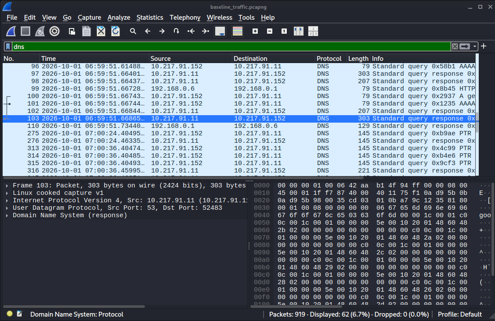
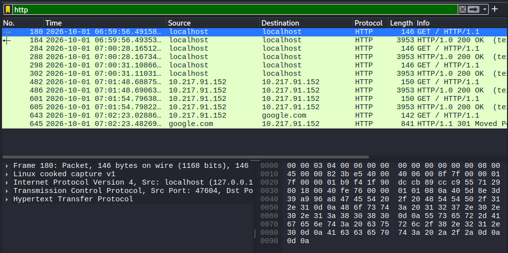
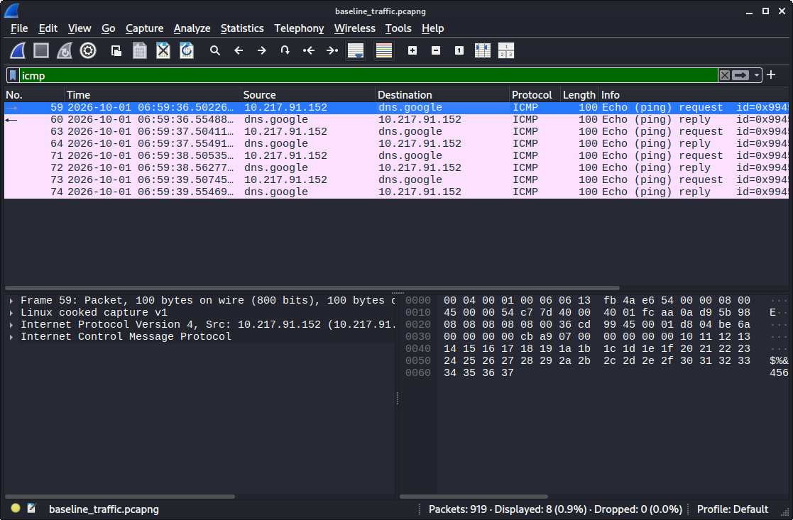
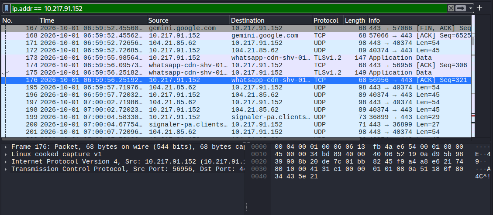
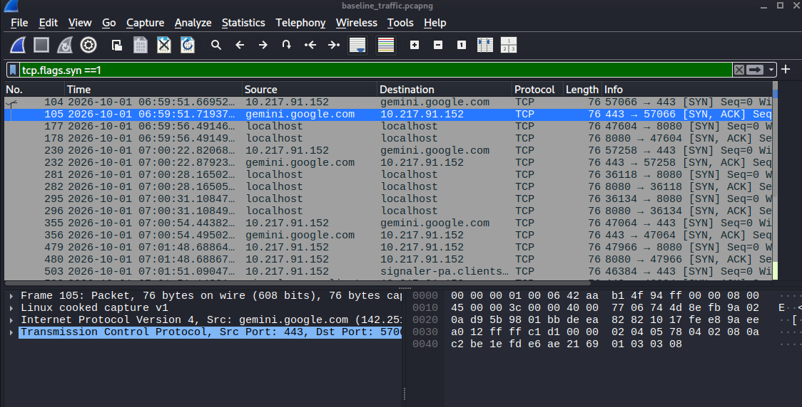
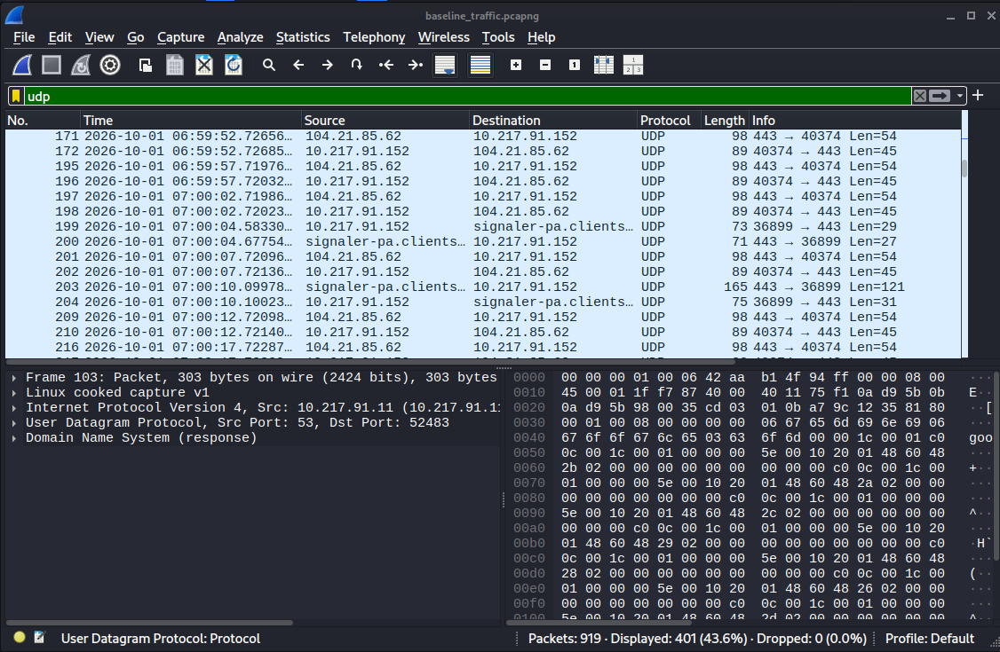
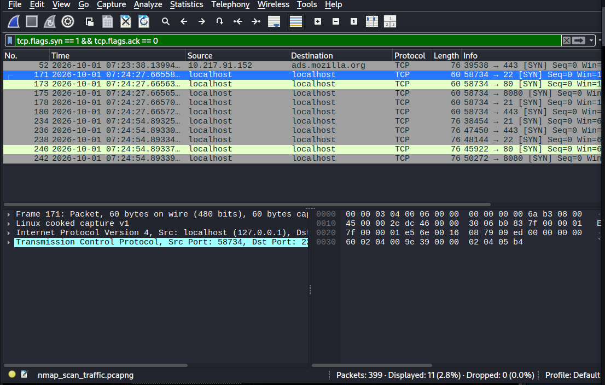
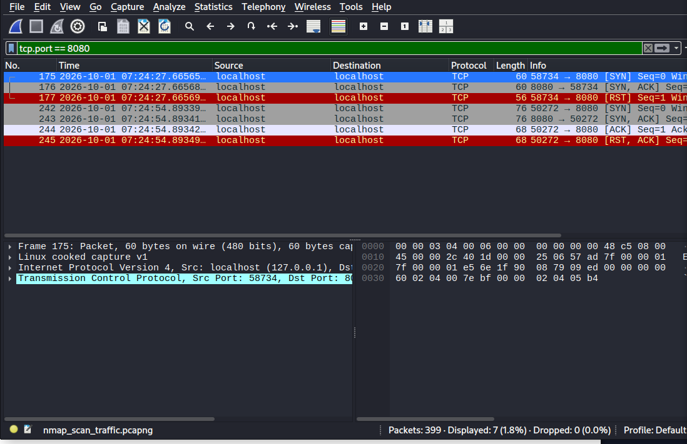
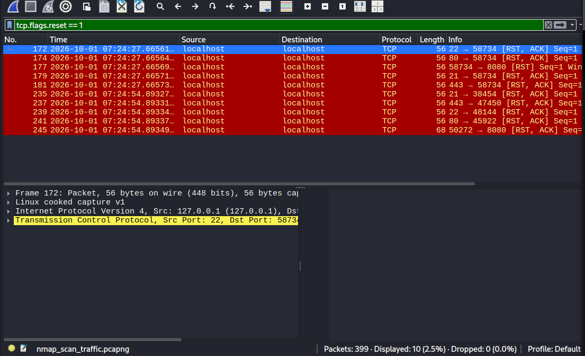

# Network Traffic Analysis using Wireshark and Nmap

## Project Objective
The objective of this project is to capture and analyze network packets in a controlled Kali Linux environment to distinguish between normal baseline protocol activity (ICMP, DNS, HTTP, TCP handshakes) and suspicious network activity generated by automated port scanning tools.

---

## Architecture / Lab Setup
* **Operating System:** Kali Linux
* **Target Environment:** Local Machine / Loopback (`127.0.0.1`) & Active wired Interface (`usb0` / `10.217.91.152`)
* **Services Hosted:** Python 3 HTTP Server running on TCP Port 8080 (`python3 -m http.server 8080`)
* **Capture Interfaces:** `usb0`, `lo` (Loopback)

---

## Tools Used
* **Wireshark / TShark:** Packet capture and display filter protocol analysis
* **Nmap:** Network exploration and port scanner (`-sS` SYN Stealth, `-sT` Connect scan)
* **Python 3:** Built-in HTTP server module
* **Curl & Ping:** Protocol traffic generation

---

## Methodology
1. **Environment Preparation:** Structured repository directories and configured Wireshark non-root execution.
2. **Baseline Traffic Generation:** Captured ICMP echo requests, DNS domain queries, and local HTTP GET requests.
3. **Protocol Filter Application:** Applied display filters to isolate TCP 3-way handshakes (`SYN`, `SYN-ACK`, `ACK`), HTTP payloads, and DNS responses.
4. **Controlled Reconnaissance Simulation:** Executed `sudo nmap -sS` and `nmap -sT` port scans against target ports (21, 22, 80, 443, 8080).
5. **Reconnaissance Analysis:** Filtered captured traffic for `SYN` probe spikes (`tcp.flags.syn == 1 && tcp.flags.ack == 0`) and reset flags (`tcp.flags.reset == 1`).

---

## Implementation and Display Filters

| Filter Type | Wireshark Display Filter Syntax | Technical Purpose |
| :--- | :--- | :--- |
| **IP Address** | `ip.addr == 10.217.91.152` | Isolates traffic to/from host interface. |
| **ICMP Filter** | `icmp` | Displays Ping echo requests and replies. |
| **DNS Lookup** | `dns` | Captures domain resolution queries and responses. |
| **HTTP / Open Port** | `tcp.port == 8080` | Filters web application traffic on active port. |
| **TCP Handshake** | `tcp.flags.syn == 1 && tcp.flags.ack == 0` | Isolates initial connection requests (`SYN` probes). |
| **Port Reset** | `tcp.flags.reset == 1` | Highlights `RST` packets returned by closed ports. |

---

## Findings and Screenshot Evidence

### 1. Normal Baseline Traffic

#### DNS Traffic Analysis
Captures standard UDP domain resolution queries and responses.

#### HTTP Traffic Analysis
Shows plain text HTTP GET requests and HTTP 200 OK responses on local port 8080.

#### ICMP Traffic Analysis
Displays Ping echo requests (`Type 8`) and echo replies (`Type 0`).

#### IP Address Filtering
Isolates all network traffic to and from host address `10.217.91.152`.

#### TCP Handshake Analysis
Examines standard TCP connection establishment (`SYN` -> `SYN-ACK` -> `ACK`).

#### UDP Protocol Traffic
Captures connectionless UDP datagram exchanges across local active services.

---

### 2. Nmap Reconnaissance Scan Analysis

#### Stealth SYN Scan Probes (`nmap -sS`)
Highlights bursts of `SYN` packets without matching `ACK` responses across probed ports.

#### TCP Connect Scan Behavior (`nmap -sT`)
Demonstrates full 3-way TCP handshakes established on open vs closed ports during enumeration.

#### Closed Port Reset Responses (`RST`)
Shows immediate TCP `RST, ACK` flags returned by closed target ports (21, 22, 80, 443).

---

## MITRE ATT&CK Mapping
* **Tactic:** Reconnaissance (`TA0043`)
* **Technique:** Active Scanning: Scanning IP Blocks (`T1595.001`) / Port Scanning (`T1595.002`)
* **Detection:** High-volume `SYN` packets without matching `ACK` completions originating from a single source host within a short time threshold.

---

## Remediation and Hardening Strategies
1. **Network Intrusion Detection System (NIDS):** Deploy Snort or Suricata rules to alert on high-frequency TCP `SYN` scans.
2. **Firewall Configuration:** Implement rate-limiting rules (`iptables` / `nftables`) to drop connections exceeding normal threshold limits.
3. **Unused Port Closure:** Disable unnecessary services and bind administrative tools strictly to loopback or management interfaces.

---

## Lessons Learned
* Host-based traffic captured on `127.0.0.1` routes via the kernel loopback (`lo`) interface and does not cross physical interfaces (`usb0`).
* Stealth SYN scanning avoids full TCP session establishment, making raw socket packet inspection critical for detection.

---

> **Safety Notice:** Scanning, exploitation, and security testing were conducted strictly within an authorized personal lab environment on local interfaces (`127.0.0.1` / `10.217.91.152`).
